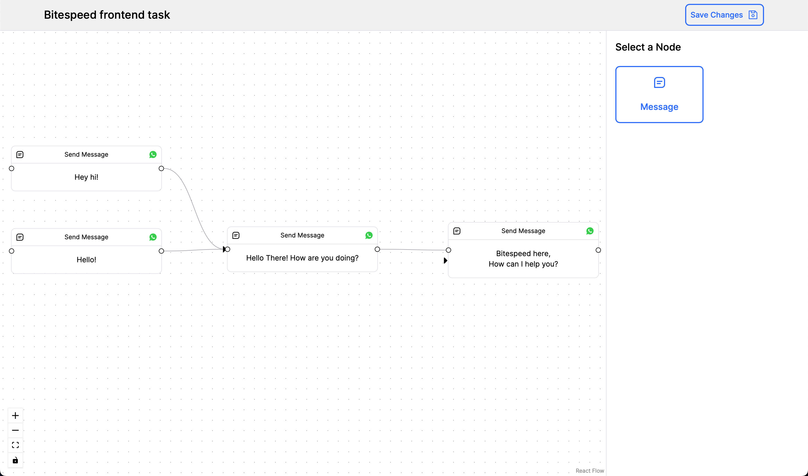

## Overview

**This is a Frontend Task by Bitespeed.**

This project aims to create a simple and extensible Chatbot Flow Builder using React. The builder will allow users to design chatbot flows by connecting multiple messages together to determine their order of execution.

Website is hosted at [bitespeed-frontend-task-sobhanbera.vercel.app](https://bitespeed-frontend-task-sobhanbera.vercel.app)

## Features

- **Message Nodes:** Define individual messages as nodes in the chatbot flow.
- **Connectors:** Link messages to dictate the sequence in which they appear.
- **Drag and Drop:** Easily arrange and connect messages using a drag-and-drop interface.
- **Extensibility:** Designed to easily add new features and functionalities as needed.

## Prerequisites

1. Node.js and npm installed on your machine.
2. Basic understanding of React.

## Getting Started

First, run the development server:

```bash
npm run dev
# or
yarn dev
# or
pnpm dev
# or
bun dev
```

Open [http://localhost:3000](http://localhost:3000) with your browser to see the result.

## Usage

- **Add a Message Node:** Drag and drop the Message Node from sidebar, to create a new message node.
- **Edit Message:** Click on a message node to edit its content.
- **Connect Messages:** Drag from the connector point on one message to another to create a link. (Source -> Target)
- **Save Flow:** Once your flow is complete, click on the "Save" button to save your flow configuration.


https://github.com/sobhanbera/bitespeed-frontend-task/assets/50291544/00e4b587-2339-4299-b026-f6c4f66121b1



### Directory Structure

```bash
src
├── app
│   ├── favicon.ico
│   ├── globals.css
│   ├── layout.js
│   └── page.js
└── components
    ├── FlowBuilder.js
    ├── Header.js
    ├── NodePanelSidebar.js
    ├── NodeSelector.js
    ├── edges                   # Custom edges
    │   └── CustomEdge.js
    ├── editors                 # Custom editors
    │   └── TextNodeEditor.js
    ├── handles                 # Custom handles
    │   └── CustomHandle.js
    └── nodes                   # Custom nodes
        └── TextMessageNode.js
```

## Extensibility

The project is designed with extensibility in mind. Here are a few ways you can extend the functionality:

- New Node Types: Add different types of nodes (e.g., decision nodes, image node, file node, etc). This can be done by creating a new component in [`components/nodes`](./src/components/nodes/) folder.

- Create custom editor: Add custom image editor, file input, etc. This can be done by creating a new component in [`components/editors`](./src/components/editors/) folder.

## Refrences

- [React Flow Documentation](https://reactflow.dev/docs)
- [Notion Page](https://bitespeed.notion.site/BiteSpeed-Frontend-Task-Chatbot-flow-builder-fb0feb3498294929a9b7171bcb4e8a8b)
